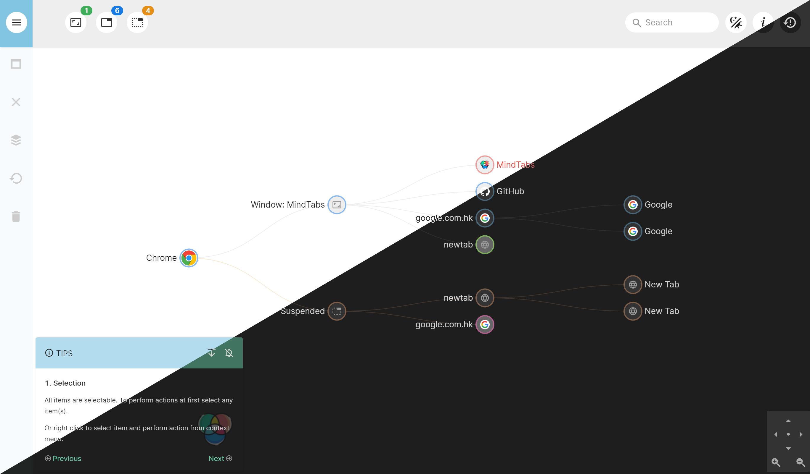

# MindTabs

A Chrome extension for tab managing.

## COPYRIGHT

The Original Extension is called [**GraphiTabs**](https://chrome.google.com/webstore/detail/graphitabs/dcfclemgmkccmnpgnldhldjmflphkimp), available via Chrome Web Store.

Since there is no way of any contact therefore no permissions from the author, this repository is **restricted** to **PERSONAL USES ONLY**. *Original author: [Timedesk team](http://www.timedesk.org) link deprecated before Jan 9th, 2021)*.

MindTab's work is based on the GraphiTabs extension, and is currently not released to Chrome Web Store yet because of this issue.

**Please consider to support the ORIGINAL author via [GraphiTabs](https://chrome.google.com/webstore/detail/graphitabs/dcfclemgmkccmnpgnldhldjmflphkimp) FIRST,** *(and please try to establish contact if possible)*. Then if you are not satisfied with GraphiTabs, consider switching to MindTabs.

## Features

The **MindTabs** Extension, compared to **GraphiTabs**, improves only on UI.

- **Icons** are refreshed using [MaterialDesign-Webfont](https://github.com/Templarian/MaterialDesign-Webfont).
- *Removed dependency of font-awesome and iconFont*
- **Dark theme** is now supported.
- A light/dark **switch** to cover diverse needs
- Font/icon size improved
- Layout improved

## Issue and Pull Request

Both are welcomed, especially pull request.
